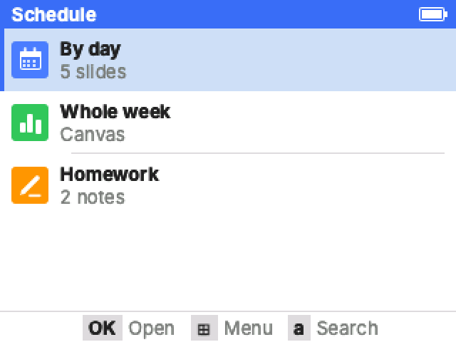
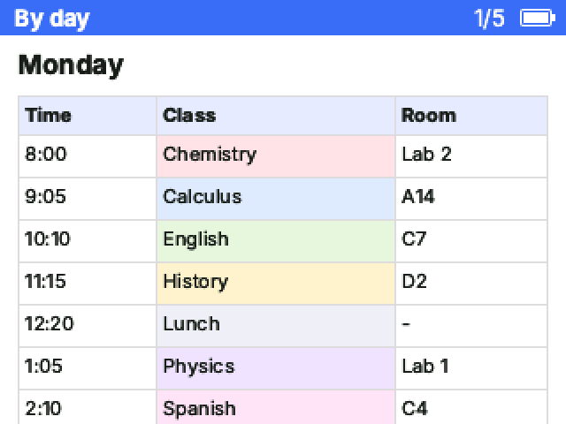
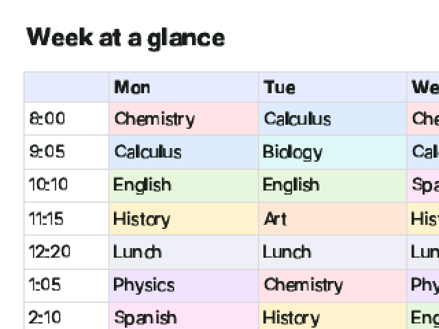
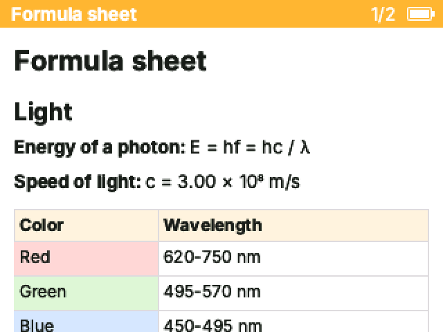
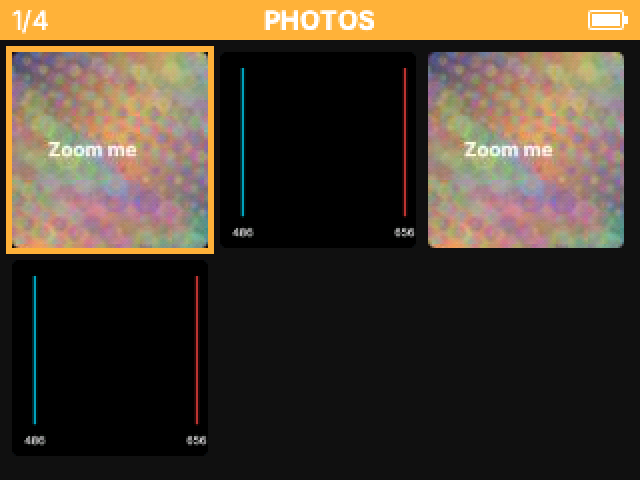
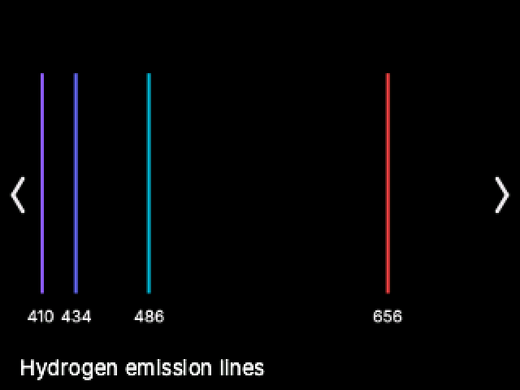
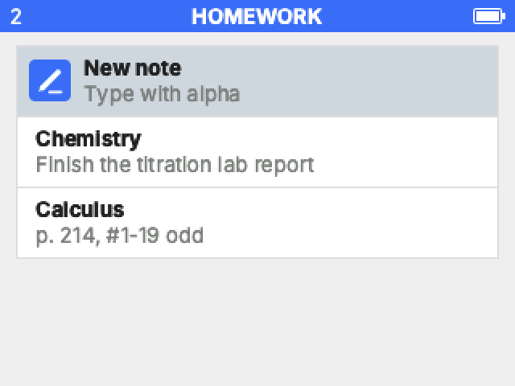
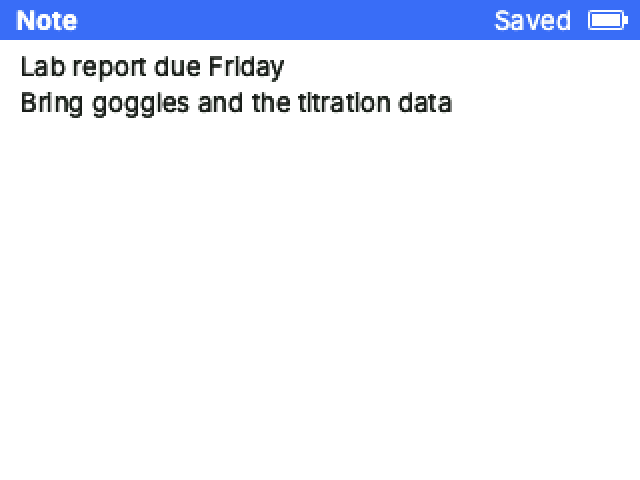
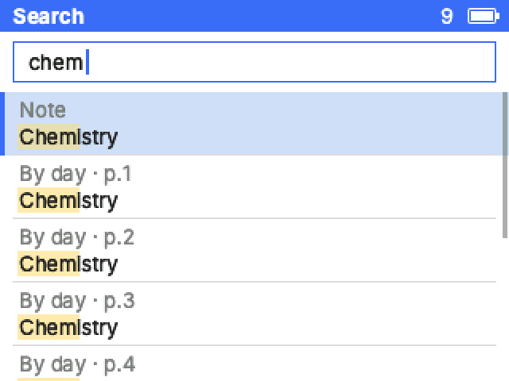

<p align="center">
  
</p>

<h1 align="center">NumNotes</h1>

<p align="center">
  <b>Your notes, pictures and schedules, as an app on your NumWorks calculator.</b><br>
  Drop in files, arrange them, press Send. No installs, no accounts.
</p>

<p align="center">
  <a href="https://mason363.github.io/NumNotes/"><b>Open NumNotes</b></a>
</p>

<table>
  <tr>
    <td></td>
    <td></td>
    <td></td>
  </tr>
  <tr>
    <td></td>
    <td></td>
    <td></td>
  </tr>
  <tr>
    <td></td>
    <td></td>
    <td></td>
  </tr>
</table>

<p align="center"><sub>Real screens, rendered by the same code that runs on the calculator.</sub></p>

## What it does

- **Takes anything.** Photos (iPhone HEIC too), PDFs, GIFs, short videos, Word files, Markdown, CSV, plain text, or a paste from the clipboard.
- **Shows it your way.** Every section picks a view:
  - **Slides**, flipped with the arrows, with autoplay if you want it.
  - **Document**, a scrolling page of text, tables, pictures and formulas.
  - **Canvas**, one big board you pan and zoom.
  - **Gallery**, a grid of pictures that open full screen.
  - **Notes**, a notebook you type into on the calculator.
- **Real color.** Charts, diagrams and photos keep their colors and stay sharp, with extra detail for zooming in. Crop, rotate and tune any picture.
- **Installs itself.** Plug the calculator in and press Send. Your other apps stay where they are. Or download the `.nwa` and add it at [my.numworks.com/apps](https://my.numworks.com/apps).
- **Type on the calculator.** Write notes with the keyboard. They stay on the calculator, even when you send an updated version.
- **Find things fast.** Search everything, bookmark spots, jump to a page, open a table of contents.
- **Make it yours.** App name, icon, colors, fonts, and what it opens to.
- **Private.** Everything happens in your browser. Nothing is uploaded.

## How to use it

1. Open [NumNotes](https://mason363.github.io/NumNotes/) and start from a template or a blank app.
2. Drop in files and arrange them. The calculator on the right shows exactly what you'll get, and you can click its keys.
3. Plug in your calculator and press **Send to calculator**.

## On the calculator

| Key | Does |
| --- | --- |
| Arrows | Move, scroll, pan |
| OK | Open, or view a picture full screen |
| + and − | Zoom |
| EXE | Play slides, or fly to the next spot on a canvas |
| 0 to 9 | Go to a page |
| Toolbox | Menu |
| var | Bookmarks |
| alpha, then letters | Search |
| ans | Jump back |
| Back / Home | Back / leave the app |

## Requirements

- A NumWorks N0110, N0115 or N0120 with up-to-date software.
- Sending straight to the calculator needs Chrome or Edge. Any modern browser can build the app and download the `.nwa`.

## FAQ

**Does it work in exam mode?** No. NumWorks hides third-party apps during exam mode.

**How much fits?** Usually a couple of megabytes. The meter at the top shows how much your app uses. Photos set to Compact take the least space.

**Where are my projects?** In your browser. Use Download, then Project file, to keep a backup or move to another computer.

## Build it yourself

You need Node 24, `arm-none-eabi-gcc`, and clang with `wasm-ld`.

```sh
make dev     # run the site locally
make test    # run all tests
make         # production build in web/dist
```

`viewer/` is the calculator app, written in C. `web/` is the site: it packs your content, links the app for your calculator and flashes it over WebUSB.

## License

MIT. See [LICENSE](LICENSE).

NumWorks is a registered trademark of NumWorks SAS. NumNotes is an independent project and is not affiliated with NumWorks. The calculator photo shown in the editor is loaded from NumWorks' site.
